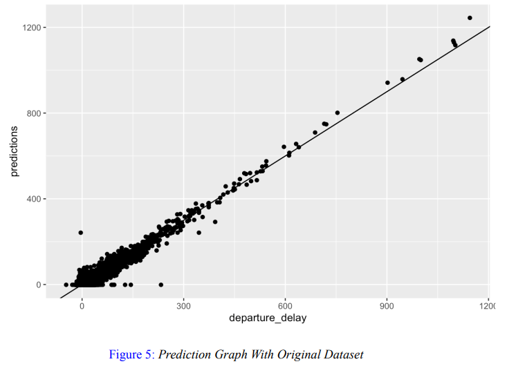
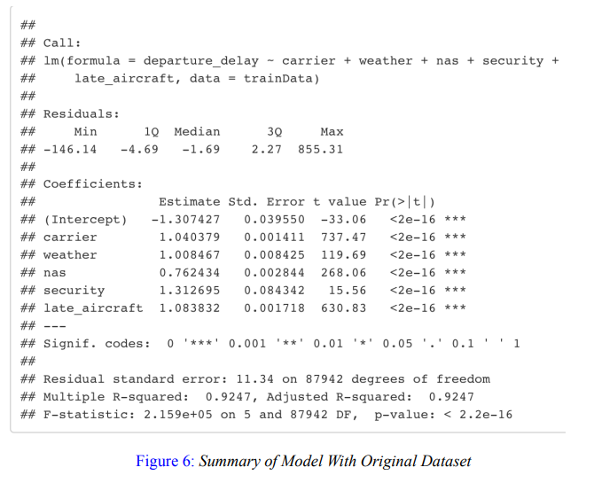

# Shaun Tran - Projects Portfolio 

## Background
As a passionate data scientist, my portfolio displays my expertise in utilizing sophisticated analytical methods on intricate data sets. My projects, ranging from predictive modeling to data visualization, exhibit my proficiency in employing data to tackle real-world challenges.

## Index

### [Project 1: Predicting and Analyzing Causes of Delay for Flight Departures](https://github.com/hshauntr/CausesOfDelays)
Paired with a growing population is a demand for travel. In My study, I closely examined
airline departure times by comparing their scheduled and actual departure times. I considered a delay to
be any difference of 15 minutes or more and recorded the cause of the delay. To ensure a fair assessment
of each airline’s performance, I collected data from a single airport every day for 10 years. By applying
knowledge I acquired in class, I used R to employ linear regression, trained a mathematical model
and optimized it with least squares to create training and testing sets. By utilizing mathematical analysis
through T values, P values, and R-squared values, My results offer valuable insights into airline
performance regarding flight departures. My model can be used to predict future performance and
analyze past data to identify the most common causes of delay in the departure statistics. A valuable
resource that can help both airline companies and consumers. This is proven when I practiced my
model on departing flights from Delta Airlines at the San Francisco International Airport from January
2013 until 2023, and recognized that flight carrier delay and late arriving aircraft were the biggest causes
of delays, suggesting that it is well within an airline’s control to improve their on-time performance.

- Implemented mathematical skills to build a mathematical model, using R for linear regression modeling and least squares optimization.
- Demonstrated strong analytical skills by conducting mathematical analysis on the regression model, observing what the results that the model depicts.
- Utilized real world large datasets of flight departure data to identify and analyze causes of delays.
- Addressed practical challenges in the aviation industry, showcasing the ability to apply data science to real-world problems.
- Presented clear and concise findings, highlighting effective communication skills.

### [Project 2: Data Structure of a Questionnaire](https://github.com/hshauntr/VotingQuestionnaire)
- Used Python for data handling and manipulation by efficiently reading and storing survey data in a Python data structure. Questionnare had 512 entries.
- Implemented Plurality voting, Borda voting, Condorcet voting, Instant-runoff (IRV) voting, and Approval voting, showcasing versatility in voting systems.
- Provided practical decision-making support with clear winner selections or draws.
- Inform the user of the results, including total votes and winner.

### [Project 3: Earthquake Data Visualization](https://github.com/hshauntr/EarthQDataV)
- Reading and storing earthquake data from a .csv file into a MATLAB table data structure.
- Created an interactive GUI with a world map and 2D plots to visualize earthquake occurrences, locations, and magnitudes for a given year.
- Utilized geobubble function to efficiently plot earthquake data on the world map, showcasing technical proficiency in data visualization.
- Ensured user-friendly experience by providing labels on figures, buttons, axes, and plots, along with a legend for the earthquake bubble chart.
- Effectively presented temporal changes in earthquake occurrences by updating the plot based on the user's chosen year.
- The project's focus on earthquake data visualization highlights the real-world application of data science in understanding geospatial patterns and seismic activity.

## Contact me 
**Email:** hshauntr@gmail.com
**LinkedIn:** [https://www.linkedin.com/in/hshauntr/](https://www.linkedin.com/in/hshauntr/)
